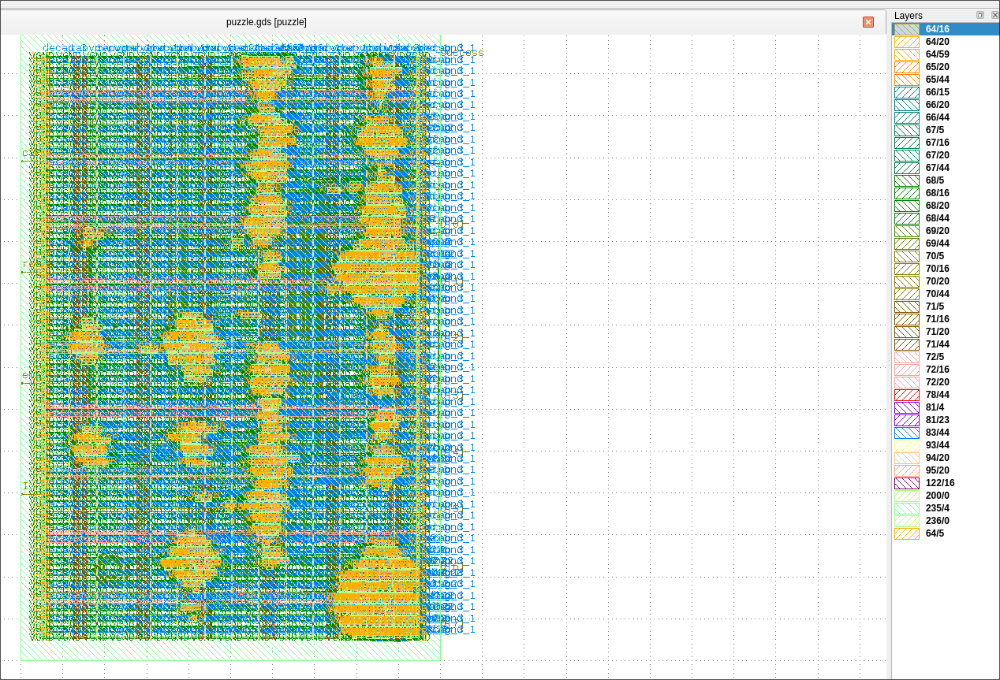
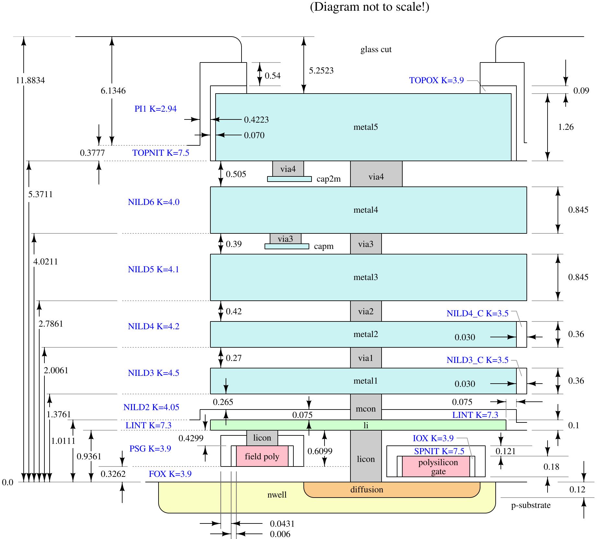

Link to the original Jane Street [blog](https://blog.janestreet.com/can-you-reverse-engineer-an-asic/)

# A short introduction 
Hello! My name is Shubham, I am pursuing bachelors of technology in Computer Science at MAIT, Delhi, Batch 2025-2029.
I like fiddling with hardware, software and everything that comes in between! 

# The Challenge
Jane street released a new challenge for 2026, that was to reverse engineer an ASIC (Application Specific Integrated Circuit), which are integrated circuits customized for a particular use, given by them.

The official JaneStreet blog does a pretty good job at explaining the steps from creating a description of the chip in an HDL (here, Verilog) to manufacturing the full blown chip from the GDS file, so we will be solely focusing on the Reverse engineering process of this IC (integrated circuit). 

## What Jane Street provided us with:
JS provided a [repository](https://github.com/janestreet/asic-puzzle-2026) with 
- the `puzzle.gds` file (the circuit we have to reverse engineer), can be viewed in softwares such as `klayout` 
- `example_inputs.vcd` which is a 'Value Change Dump' file which we can view in a waveform viewing software like `gtkwave` (which I have used) to view the example inputs and how the circuit behaves, 
- `layout.png` : the physical layout of the circuit
- and a `warmup/` directory, which is a test repo where you can test out your solutions. This subrepo helps a ton as it provides a way for us to confirm if the solver we are building is actually correct. I had done a lot of tests on this warmup directory to get a working plan of the solver.


The physical layout of the circuit.


# RE'ing it!

## The GDS File and the PDK used
A GDS file is a binary, byte-stream database representing 2D shapes, text annotations and structural hierarchy. It can be viewed visually in softwares like `klayout`, which can also be used to parse them.

Inspecting the chip in either klayout or python tells us that the chip uses the SkyWater 130 nm pdk (process design kit), which is like a collection of files or rules that define how the CMOSFETS (complimentary metal oxide semiconductor field transistors, or simply, transistors) must be laid out to translate a described logic gate to the real physical layout.

SkyWater 130 nm PDK is [open source](https://github.com/google/skywater-pdk), the documentation is easily accessible [here](https://skywater-pdk.readthedocs.io/en/main/index.html). 

Viewing the `puzzle.gds` file in klayout shows us....


well...yeah this is quite a bit of a mess :,) Lets decode it

-> On the left, we see the circuit, the circuit's true layout and how it would look if processed and manufactured in a semiconductor facility. 

-> On the right we see various *layers*, which can be toggled on and off within klayout. 

The metal stack for the SkyWater130 nm PDK looks something like this:



[Source from the official docs](https://skywater-pdk.readthedocs.io/en/main/_images/metal_stack.svg)

Mapping the layers from the skywater 130nm pdk, we get a table of the physical layer map:

| Logical Name | GDS Layer / Datatype | Material | Function in Puzzle Die |
| :--- | :---: | :--- | :--- |
| prBoundary | 235 / 4 | Boundary | Die perimeter ($200.00 \times 353.60\,\mu\text{m}$) |
| li1 (drawing) | 67 / 20 | Titanium Nitride (TiN) | Standard cell boundary pins and local intra-cell wiring |
| li1 (pin label) | 67 / 5 | Text Annotations | Gate port names (A, B, X, CLK, D, Q, etc.) |
| mcon (cut) | 67 / 44 | Tungsten Plug | Via cuts connecting li1 ↔ met1 (19,764 cuts) |
| met1 (drawing) | 68 / 20 | Metal 1 (Al/Cu) | Horizontal routing tracks along standard cell rows |
| via1 (cut) | 68 / 44 | Via 1 | Via cuts connecting met1 ↔ met2 (6,869 cuts) |
| met2 (drawing) | 69 / 20 | Metal 2 (Al/Cu) | Vertical routing tracks across standard cell rows |
| via2 (cut) | 69 / 44 | Via 2 | Via cuts connecting met2 ↔ met3 (3,423 cuts) |
| met3 (drawing) | 70 / 20 | Metal 3 (Al/Cu) | Horizontal signal buses and Top-Level I/O Landing Pads |
| met3 (pin label) | 70 / 5 | Text Annotations | Top-level I/O port names (clk, rst_n, enable, I, success, O[0..7]) |
| via3 (cut) | 70 / 44 | Via 3 | Via cuts connecting met3 ↔ met4 (3,159 cuts) |
| met4 (drawing) | 71 / 20 | Metal 4 (Al/Cu) | Long-range vertical routing tracks (45 segments) |
| via4 (cut) | 71 / 44 | Via 4 | Via cuts connecting met4 ↔ met5 (108 cuts) |
| met5 (drawing) | 72 / 20 | Metal 5 (Al/Cu) | Global supply rails (18 segments) |


## The Plan

The plan is pretty simple, it'll go in steps:
1. We parse the GDS file, parsing the cells , all the polygons, all the pads
2. We take a union of all the overlapping polygons 
3. We then parse the interconnects, connecting adjacent layer's interconnects and union them, hence finding all the connections present in the ASIC 
4. We store all the data we have gotten in a JSON format
5. We generate a netlist from the parsed cells, polygons and pads
6. We point a SAT solver at the extracted netlist, set constraints and find the exact key at which we get `success == 1`
7. ???
8. Profit! Uh- I mean we get the hidden flag!


## Parsing the GDS File

We used `pya` inside python, which is the official Python API binding for KLayout for parsing `puzzle.gds`.
The only goal of parsing the GDS file is to find the connections of the circuit, which will be used to extract and generate a ***netlist*** file of the logic gates. 

We filter out the physical cells that contain no input or output pins (`tap..`, `decap..`, `diode..`, `fill..`). These cells are only for physical manufacturing and don't carry any logic signals. 

Out of the 9,875 total placed cells in the raw GDS, filtering these leaves us with exactly **728 functional logic cells**.

> The DBU: DataBaseUnits for this ASIC is nanometers.

> The standard cell rows have fixed heights of 2720 DBU (2.72 um) and pitch width quantized in multiples of 460 DBU.

> • Even rows are oriented normally (R0), spanning [y_0, y_0 + 2.72 um].  
> • Odd rows are inverted (180 degree rotation R180 or reflected along X MX), spanning [y_0 - 2.72um, y_0].

### Storing our Cell Inventory (`parsedCells.json`)

One quirk with raw GDSII files is that placed cell instances don't have human-readable Verilog names like `inst_0`, `inst_1`, etc. The GDS file just knows "put a NAND gate at coordinate (x, y) with this rotation".

So, we create a master inventory of all 728 functional cells and store them in `outputs/parsedCells.json`. Each cell gets:
- A unique deterministic ID (`0` to `727`)
- Its cell type (e.g. `sky130_fd_sc_hd__nand2_2`)
- Its exact physical placement (x, y) on the chip
- Its rotation angle and whether it is mirrored (standard cell rows alternate flipping so adjacent rows can share power rails)

Later, we will figure out which wires touch which cell pins using the JSON, which maps the coordinates back to these IDs to cleanly generate our Verilog instances:

```verilog
sky130_fd_sc_hd__nand2_2 inst_42 (.A(net_15), .B(net_88), .Y(net_104));
```

To know where a pin actually lands on the full die, we take the local pin coordinates from inside the cell definition and apply an **affine transformation** (`inst.cplx_trans` in `pya`). This handles the rotation, row-mirroring, and (x, y) displacement to find the exact global (X, Y) spot on the silicon die where the wire connects.

## Its Union Time! <sub>*\*starts unionising all over the place\**</sub>


 
Uniting the polygons will take place in two stages:
- Intra-layer: shapes overlapping or touching the same conductor layer are electrically connected
- Inter-layer: shapes on adjacent layers are electrically connected iff they are bridged by a physical interconnect (`mcon`s or `via`s)

We will be using a *Disjoint Set Union* for the following. 

Layer Lk, adjacent layer Lk+1, interconnect polygon V, interconnect layer Ck
   $$(P_{\text{below}} \cap V) \neq \emptyset \land (P_{\text{above}} \cap V) \neq \emptyset$$
   
We flatten the design's structural hierarchy to the top-level cell; this moves all internal subcell polygons into a single global coordinate space, making polygon merging and spatial lookup much easier.

> We parse a total of 12,615 merged continuous polygons across the 6 layers, acting as the nodes of the graph.

> We parse a total of 33,323 interconnects across the entire chip

Okayyyy, so we have 12'615 metal polygons and 33'323 interconnects, checking *every* interconnect against *every* polygon would take around **4.2 * 10^8** operations!

> [!WARNING]
> This would take around *420 million* operations ($O(V \cdot P)$),, quite a hefty amount of minutes I'd say.

How do we solve this then? We don't have an eternity to get the key?!
WELL I borrowed really cool trick from video game collision engines! Enter...

### a 2D Spatial Hash Grid

The idea is simple:

1. We divide the silicon floorplan into a 2.0 * 2.0 um^2 spatial buckets. (`CELL_SIZE = 2000 DBU`)

2. For every merged polygon $P_i$ with bounding box $[x_{\text{min}}, y_{\text{min}}, x_{\text{max}}, y_{\text{max}}]$:

 compute integer spatial cell ranges:
   $$gx_{\text{start}} = \lfloor x_{\text{min}} / \text{CELL\_SIZE} \rfloor, \quad gx_{\text{end}} = \lfloor x_{\text{max}} / \text{CELL\_SIZE} \rfloor$$
   $$gy_{\text{start}} = \lfloor y_{\text{min}} / \text{CELL\_SIZE} \rfloor, \quad gy_{\text{end}} = \lfloor y_{\text{max}} / \text{CELL\_SIZE} \rfloor$$

 insert polygon index $i$ into every intersecting bucket:
   $$\forall (gx, gy) \in [gx_{\text{start}}, gx_{\text{end}}] \times [gy_{\text{start}}, gy_{\text{end}}]: \quad \text{grid}[(gx, gy)].\text{append}(i)$$

3. When querying a via bounding box $V = [vx_1, vy_1, vx_2, vy_2]$, only candidates in buckets spanning $V$ are inspected:

$$\text{Candidates}(V) = \bigcup_{gx, gy \in \text{Cover}(V)} \text{grid}[(gx, gy)]$$

This reduces candidate polygon evaluations from 12,615 down to 1–4 polygons per via, dropping the search complexity to $O(1)$ average time per cut.

We put the connected polygons across 12'615 nodes in the DSU.

After processing all 33,323 via unions:

1. Iterate every node $u \in [0, 12614]$.
2. Compute canonical representative root: $r = \text{DSU.find}(u)$.
3. Assign contiguous integer Net IDs $0, 1, 2, \dots, 740$:
   $$\text{root\_to\_net}[r] \to \text{Net ID}$$

> This gives us 741 totoal unique electrical nets.
