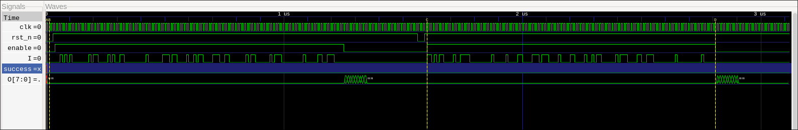
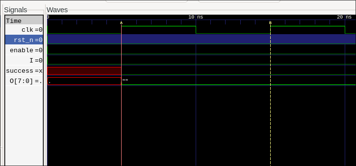
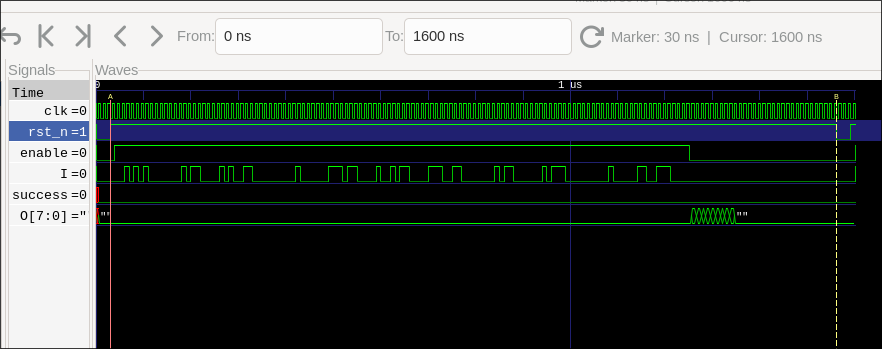
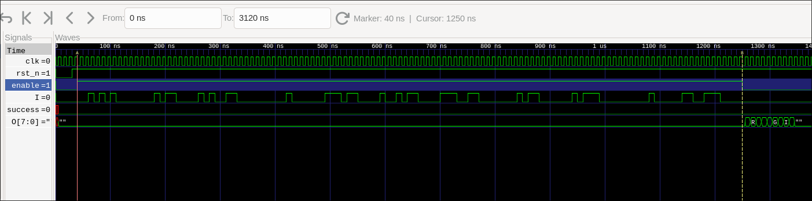
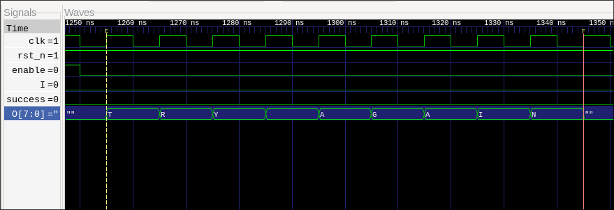
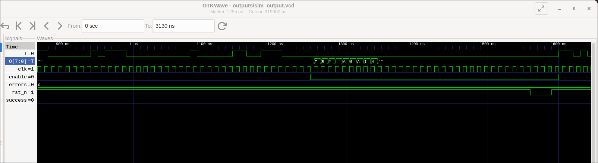
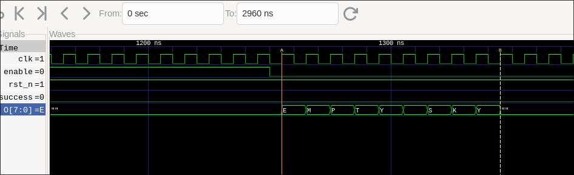
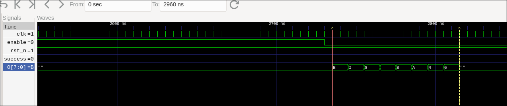
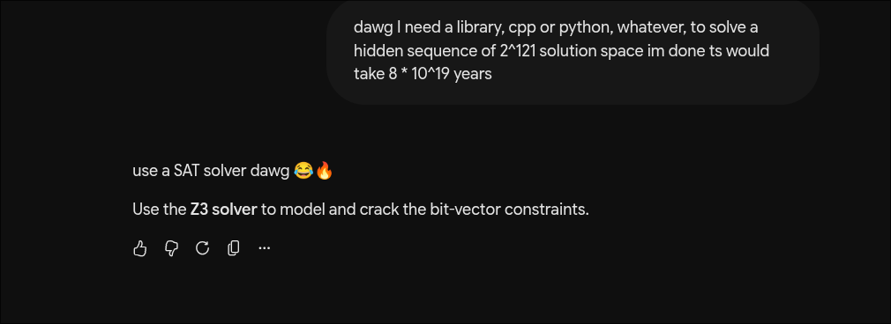

<script>
MathJax = {
  tex: {
    inlineMath: [['$', '$'], ['\\(', '\\)']],
    displayMath: [['$$', '$$'], ['\\[', '\\]']],
    processEscapes: true
  }
};
</script>
<script id="MathJax-script" async src="https://cdn.jsdelivr.net/npm/mathjax@3/es5/tex-mml-chtml.js"></script>

Link to the original Jane Street [blog](https://blog.janestreet.com/can-you-reverse-engineer-an-asic/)

# A short introduction 
Hello! My name is Shubham, I am pursuing bachelors of technology in Computer Science at MAIT, Delhi, Batch 2025-2029.
I like fiddling with hardware, software and everything that comes in between! 

# The Challenge
Jane street released a new challenge for 2026, that was to reverse engineer an ASIC (Application Specific Integrated Circuit), which are integrated circuits customized for a particular use, given by them.

The official JaneStreet blog does a pretty good job at explaining the steps from creating a description of the chip in an HDL (here, Verilog) to manufacturing the full blown chip from the GDS file, so we will be solely focusing on the Reverse engineering process of this IC (integrated circuit). 

## What Jane Street provided us with:
JS provided a [repository](https://github.com/janestreet/asic-puzzle-2026) with 
- the `puzzle.gds` file (the circuit we have to reverse engineer), can be viewed in softwares such as `klayout` 
- `example_inputs.vcd` which is a 'Value Change Dump' file which we can view in a waveform viewing software like `gtkwave` (which I have used) to view the example inputs and how the circuit behaves, 
- `layout.png` : the physical layout of the circuit
- and a `warmup/` directory, which is a test repo where you can test out your solutions. This subrepo helps a ton as it provides a way for us to confirm if the solver we are building is actually correct. I had done a lot of tests on this warmup directory to get a working plan of the solver.


The physical layout of the circuit.

# Quick Terminology Guide

Before diving into the reverse engineering, let's clarify the key terms we will be tossing around so everyone is on the same page:

* **Cells vs. Instances:**
  * **Cell (Master Blueprint):** A standard library template (e.g. `sky130_fd_sc_hd__nand2_2`). Think of it as a LEGO block design in the manual.
  * **Instance:** A specific, physical copy of that cell placed at a coordinate on the chip (e.g. `inst_42` placed at $x = 97.52\,\mu\text{m}, y = 70.72\,\mu\text{m}$).

* **Ports vs. Instance Pins:**
  * **Port:** The named input/output terminal on a cell's blueprint (e.g. inputs `A`, `B`, and output `Y` for an AND gate).
  * **Instance Pin:** The actual microscopic metal contact point on Layer 67 (`li1`) of a specific instance where wires attach. There are **2,791 instance pins** across our 728 gates.

* **Metal Polygons vs. Interconnects (Vias):**
  * **Metal Polygons:** 2D horizontal metal shapes drawn on a single conductor layer (`li1`, `met1` ... `met5`). They act as horizontal hallways for electrons on that floor.
  * **Interconnect / Vias:** Vertical metal plugs (`mcon`, `via1` ... `via4`) that bridge adjacent metal layers vertically.

* **Nets (Electrical Wires):**
  * When touching polygons on the same layer and vertical vias between layers are united together, they form one continuous electrical wire called a **Net** (`net_15`). 

* **I/O Pads (External World):**
  * Big metal landing squares on the chip's top surface (Layer 70 `met3`) where test probes or package pins connect. This chip has **13 top-level pads**: 4 inputs (`clk`, `rst_n`, `enable`, `I`) and 9 outputs (`success`, `O[7:0]`) as seen from the layout image.

```verilog
//                  Cell Port Names (.A, .B, .Y)
//                     │           │           │
sky130_nand2 inst_42 (.A(net_15), .B(net_88), .Y(net_104));
//    ▲         ▲         └─────┬─────┘────────────────┘
//  Cell      Instance    Nets (continuous 3D wires)
```


# RE'ing it!

## The GDS File and the PDK used
A GDS file is a binary, byte-stream database representing 2D shapes, text annotations and structural hierarchy. It can be viewed visually in softwares like `klayout`, which can also be used to parse them.

Inspecting the chip in either klayout or python tells us that the chip uses the SkyWater 130 nm pdk (process design kit), which is like a collection of files or rules that define how the CMOSFETS (complimentary metal oxide semiconductor field transistors, or simply, transistors) must be laid out to translate a described logic gate to the real physical layout.

SkyWater 130 nm PDK is [open source](https://github.com/google/skywater-pdk), the documentation is easily accessible [here](https://skywater-pdk.readthedocs.io/en/main/index.html). 

A basic breakdown of the skywater130 standard cell looks like this:

```text
sky130_fd_sc_hd__<function>_<drive_strength>

sky130 _ fd _ sc _ hd __ nand2 _ 2
  │       │    │    │      │     └── Drive Strength: 2x transistor width (higher fanout capability)
  │       │    │    │      └──────── Logic Function: 2-input NAND
  │       │    │    └─────────────── Library Variant: High Density (2.72 um row pitch)
  │       │    └──────────────────── Standard Cell
  │       └───────────────────────── Foundry: SkyWater
  └────────────────────────────────── Process Node: 130 nm
```


Viewing the `puzzle.gds` file in klayout shows us....


well...yeah this is quite a bit of a mess :,) Lets decode it

-> On the left, we see the circuit, the circuit's true layout and how it would look if processed and manufactured in a semiconductor facility. 

-> On the right we see various *layers*, which can be toggled on and off within klayout. 

The metal stack for the SkyWater130 nm PDK looks something like this:


[Source from the official docs](https://skywater-pdk.readthedocs.io/en/main/_images/metal_stack.svg)

Mapping the layers from the skywater 130nm pdk, we get a table of the physical layer map:

| Logical Name | GDS Layer / Datatype | Material | Function in Puzzle Die |
| :--- | :---: | :--- | :--- |
| prBoundary | 235 / 4 | Boundary | Die perimeter ($200.00 \times 353.60\,\mu\text{m}$) |
| li1 (drawing) | 67 / 20 | Titanium Nitride (TiN) | Standard cell boundary pins and local intra-cell wiring |
| li1 (pin label) | 67 / 5 | Text Annotations | Gate port names (A, B, X, CLK, D, Q, etc.) |
| mcon (cut) | 67 / 44 | Tungsten Plug | Via cuts connecting li1 ↔ met1 (19,764 cuts) |
| met1 (drawing) | 68 / 20 | Metal 1 (Al/Cu) | Horizontal routing tracks along standard cell rows |
| via1 (cut) | 68 / 44 | Via 1 | Via cuts connecting met1 ↔ met2 (6,869 cuts) |
| met2 (drawing) | 69 / 20 | Metal 2 (Al/Cu) | Vertical routing tracks across standard cell rows |
| via2 (cut) | 69 / 44 | Via 2 | Via cuts connecting met2 ↔ met3 (3,423 cuts) |
| met3 (drawing) | 70 / 20 | Metal 3 (Al/Cu) | Horizontal signal buses and Top-Level I/O Landing Pads |
| met3 (pin label) | 70 / 5 | Text Annotations | Top-level I/O port names (clk, rst_n, enable, I, success, O[0..7]) |
| via3 (cut) | 70 / 44 | Via 3 | Via cuts connecting met3 ↔ met4 (3,159 cuts) |
| met4 (drawing) | 71 / 20 | Metal 4 (Al/Cu) | Long-range vertical routing tracks (45 segments) |
| via4 (cut) | 71 / 44 | Via 4 | Via cuts connecting met4 ↔ met5 (108 cuts) |
| met5 (drawing) | 72 / 20 | Metal 5 (Al/Cu) | Global supply rails (18 segments) |


## The Plan


The plan is pretty simple, it'll go in steps:
1. We parse the GDS file, parsing the cells , all the polygons, all the pads
2. We take a union of all the overlapping polygons 
3. We then parse the interconnects, connecting adjacent layer's interconnects and union them, hence finding all the connections present in the ASIC 
4. We store all the data we have gotten in a JSON format
5. We generate a netlist from the parsed cells, polygons and pads
6. We point a SAT solver at the extracted netlist, set constraints and find the exact key at which we get `success == 1`
7. ???
8. Profit! Uh- I mean we get the hidden flag!


## Parsing the GDS File

We used `pya` inside python, which is the official Python API binding for KLayout for parsing `puzzle.gds`.
The only goal of parsing the GDS file is to find the connections of the circuit, which will be used to extract and generate a ***netlist*** file of the logic gates. 

We filter out the physical cells that contain no input or output pins (`tap..`, `decap..`, `diode..`, `fill..`). These cells are only for physical manufacturing and don't carry any logic signals. 

Out of the 9,875 total placed cells in the raw GDS, filtering these leaves us with exactly **728 functional logic cells**.

> The DBU: DataBaseUnits for this ASIC is nanometers.

> The standard cell rows have fixed heights of 2720 DBU (2.72 um) and pitch width quantized in multiples of 460 DBU.

> • Even rows are oriented normally (R0), spanning [y_0, y_0 + 2.72 um].  
> • Odd rows are inverted (180 degree rotation R180 or reflected along X MX), spanning [y_0 - 2.72um, y_0].

### Storing our Cell Inventory (`parsedCells.json`)

One quirk with raw GDSII files is that placed cell instances don't have human-readable Verilog names like `inst_0`, `inst_1`, etc. The GDS file just knows "put a NAND gate at coordinate (x, y) with this rotation".

So, we create a master inventory of all 728 functional cells and store them in `outputs/parsedCells.json`. Each cell gets:
- A unique deterministic ID (`0` to `727`)
- Its cell type (e.g. `sky130_fd_sc_hd__nand2_2`)
- Its exact physical placement (x, y) on the chip
- Its rotation angle and whether it is mirrored (standard cell rows alternate flipping so adjacent rows can share power rails)

Later, we will figure out which wires touch which cell pins using the JSON, which maps the coordinates back to these IDs to cleanly generate our Verilog instances:

```verilog
sky130_fd_sc_hd__nand2_2 inst_42 (.A(net_15), .B(net_88), .Y(net_104));
```

To know where a pin actually lands on the full die, we take the local pin coordinates from inside the cell definition and apply an **affine transformation** (`inst.cplx_trans` in `pya`). This handles the rotation, row-mirroring, and (x, y) displacement to find the exact global (X, Y) spot on the silicon die where the wire connects.

## Its Union Time! <sub>*\*starts unionising all over the place\**</sub>


 
Uniting the polygons will take place in two stages:
- Intra-layer: shapes overlapping or touching the same conductor layer are electrically connected
- Inter-layer: shapes on adjacent layers are electrically connected iff they are bridged by a physical interconnect (`mcon`s or `via`s)

We will be using a *Disjoint Set Union* for the following. 

Layer Lk, adjacent layer Lk+1, interconnect polygon V, interconnect layer Ck
   $$(P_{\text{below}} \cap V) \neq \emptyset \land (P_{\text{above}} \cap V) \neq \emptyset$$
   
We flatten the design's structural hierarchy to the top-level cell; this moves all internal subcell polygons into a single global coordinate space, making polygon merging and spatial lookup much easier.

> We parse a total of 12,615 merged continuous polygons across the 6 layers, acting as the nodes of the graph.

> We parse a total of 33,323 interconnects across the entire chip

Okayyyy, so we have 12'615 metal polygons and 33'323 interconnects, checking *every* interconnect against *every* polygon would take around **4.2 * 10^8** operations

> This would take around *420 million* operations ($O(V \cdot P)$),, quite a hefty amount of minutes I'd say.

How do we solve this then? We don't have an eternity to get the key?!
WELL I borrowed a really cool trick from video game collision engines! Enter...

### a 2D Spatial Hash Grid

The idea is simple:

1. We divide the silicon floorplan into a 2.0 * 2.0 um^2 spatial buckets. (`CELL_SIZE = 2000 DBU`)

2. For every merged polygon $P_i$ with bounding box $[x_{\text{min}}, y_{\text{min}}, x_{\text{max}}, y_{\text{max}}]$:

 compute integer spatial cell ranges:
   $$gx_{\text{start}} = \lfloor x_{\text{min}} / \text{CELL_SIZE} \rfloor, \quad gx_{\text{end}} = \lfloor x_{\text{max}} / \text{CELL_SIZE} \rfloor$$
   $$gy_{\text{start}} = \lfloor y_{\text{min}} / \text{CELL_SIZE} \rfloor, \quad gy_{\text{end}} = \lfloor y_{\text{max}} / \text{CELL_SIZE} \rfloor$$

 insert polygon index $i$ into every intersecting bucket:
   $$\forall (gx, gy) \in [gx_{\text{start}}, gx_{\text{end}}] \times [gy_{\text{start}}, gy_{\text{end}}]: \quad \text{grid}[(gx, gy)].\text{append}(i)$$

3. When querying a via bounding box $V = [vx_1, vy_1, vx_2, vy_2]$, only candidates in buckets spanning $V$ are inspected:

$$\text{Candidates}(V) = \bigcup_{gx, gy \in \text{Cover}(V)} \text{grid}[(gx, gy)]$$

This reduces candidate polygon evaluations from 12,615 down to 1–4 polygons per via, dropping the search complexity to $O(1)$ average time per cut.

We put the connected polygons across 12'615 nodes in the DSU.

After processing all 33,323 via unions:

1. Iterate every node $u \in [0, 12614]$.
2. Compute canonical representative root: $r = \text{DSU.find}(u)$.
3. Assign contiguous integer Net IDs $0, 1, 2, \dots, 740$:
   $$\text{root_to_net}[r] \to \text{Net ID}$$

> This gives us 741 totoal unique electrical nets.

### Pin Mapping 

For each standard cell instance identified:

1. We extract cell boundary pin text labels on layer (67, 5) (e.g. text "A" at local coordinate $(lx, ly)$.
2. Then transform local text coordinate to global die coordinate $(gx, gy)$.
3. Query `spatial_grids[(67, 20)]` using point bounding box $[gx, gy, gx, gy]$.
4. Perform exact point-in-polygon containment:
   $$\text{Hit if: } P_{\text{bbox}}.\text{contains}(gx, gy) \land P_{\text{poly}}.\text{inside}(gx, gy)$$
5. Find the Net ID of the enclosing li1 polygon:
   $$\text{net_id} = \text{get_net}(\text{offset}[(67, 20)] + \text{idx}(P_{\text{poly}}))$$
   $$\text{inst_pins}[(\text{instance_id}, \text{pin_name})] = \text{net_id}$$

> 2'791 instance pins get mapped across all 728 logic cells.

### Top-Level I/O Pad Extraction

Now that the internal cell pins are mapped, we need to locate the **external chip interface** (the landing pads where external signals connect to the chip).

In SkyWater 130 nm, top-level I/O pad text labels are placed on the highest global routing layer, **Metal 3** on layer `(70, 5)`:

1. We scan all text shapes on layer `(70, 5)` in the top cell:
   $$\text{Pad Labels} = \{\text{clk}, \text{rst\_n}, \text{enable}, \text{I}, \text{success}, \text{O}[0], \dots, \text{O}[7]\}$$

2. For each pad text at global coordinate $(gx, gy)$, we query `spatial_grids[(70, 20)]`.

3. Then we check for point-in-polygon containment on the enclosing `met3` (70, 20) polygon:
   $$\text{Hit if: } P_{\text{bbox}}.\text{contains}(gx, gy) \land P_{\text{poly}}.\text{inside}(gx, gy)$$

4. Finally, we assign the corresponding Net ID to each pad:
   $$\text{pad_to_net}[\text{pad\_name}] = \text{get_net}(\text{offset}[(70, 20)] + \text{idx}(P_{\text{poly}}))$$

This maps all 13 top-level pads to their internal circuit nets:
* **Inputs:** `clk` $\to$ `net_271`, `rst_n` $\to$ `net_73`, `enable` $\to$ `net_396`, `I` $\to$ `net_14`
* **Outputs:** `success` $\to$ `net_77`, `O[0..7]` $\to$ `net_65`, `net_157`, `net_67`, `net_113`, `net_112`, `net_82`, `net_123`, `net_80`

---

## Net Binding & Generating `extracted_netlist.v`

With both instance pins and top-level I/O pads mapped to their Net IDs, we can finally emit the structural Verilog netlist:

1. **We declare Module & Wires:** Define module ports and instantiate all **741 internal wires** (`wire net_0;` to `wire net_740;`).

    ```verilog
    `timescale 1ns/1ps
    module puzzle_extracted (clk, rst_n, enable, I, success, O);
      input wire clk, rst_n, enable, I;
      output wire success;
      output wire [7:0] O;
    ```

    ```verilog
    wire net_0;
    wire net_1;
    ...
    wire net_740;
    ```

2. **Binding Top-Level Pads:** We add continuous `assign` statements connecting the external input/output ports to internal Net IDs:

   ```verilog
   assign net_271 = clk;
   assign net_73  = rst_n;
   assign net_396 = enable;
   assign net_14  = I;
   assign success = net_77;
   assign O[0]    = net_65;
   // ...
   ```

3. **Instantiating Standard Cells:** We iteratre through our `parsedCells.json` database and wire up each gate using `inst_pins[(iid, pin_name)]`:
   ```verilog
   sky130_fd_sc_hd__nand2_2 inst_0 (.A(net_15), .B(net_88), .Y(net_104));
   sky130_fd_sc_hd__dfrtp_2 inst_26 (.CLK(net_271), .D(net_74), .Q(net_44), .RESET_B(net_73));
   ```

The output is written directly to `outputs/extracted_netlist.v`. We have officially extracted a complete and fully connected gate-level Verilog netlist straight from the polygons


## Modelling Gate Behaviour and dealing with PDK Semantics

We have gotten the verilog netlist, but trying to compile this netlist alone without the logical definitions behind the SkyWater130 nm cells would not work.

What we do to fix this, is we create a Verilog file called `sky130_cells.v` which provides the behavioural simulation models for all the SkyWater cell types, derived from the official documentation.

I'll be honest, these standard cell definitions were generated directly from the official SkyWater PDK specifications with the heavy usage of LLMs, writing all those logic behaviours by hand would've been extremely tedious.

I'll still provide a table to summarize the breakdown across the 728 functional standard cells instantiated in sky130_cells.v:


| Cell Class | Cell Name Examples | Instances | Transfer Function $f(\text{Inputs})$ |
| :--- | :--- | :---: | :--- |
| Inverters | `inv_2` | 25 | $Y = \neg A$ |
| Buffers | `buf_2`, `clkbuf_4/8/16` | 33 | $X = A$ |
| NAND Gates | `nand2/3/4_2`, `nand2b/3b_2` | 81 | $Y = \neg \left( \bigwedge A_i \right)$ |
| NOR Gates | `nor2/3/4_2`, `nor3b/4b_2` | 62 | $Y = \neg \left( \bigvee A_i \right)$ |
| AND Gates | `and2/3/4_2`, `and2b/3b/4b/4bb_2` | 103 | $X = \bigwedge A_i$ |
| OR Gates | `or2/3/4_2`, `or3b/4b/4bb_2` | 52 | $X = \bigvee A_i$ |
| XOR / XNOR | `xor2_2`, `xnor2_2` | 50 | $X = A \oplus B, \quad Y = \neg(A \oplus B)$ |
| AOI Gates | `a21o`, `a21oi`, `a22o`, `a31o`, etc. | 120 | $Y = \neg ((A_1 \land A_2) \lor B_1)$ |
| OAI Gates | `o21a`, `o21ai`, `o22a`, `o31a`, etc. | 83 | $Y = \neg ((A_1 \lor A_2) \land B_1)$ |
| Multiplexers | `mux2_1` | 21 | $X = \text{ite}(S, A_1, A_0)$ |
| Constants | `conb_1` | 6 | $\text{HI} = \mathbf{1'b1}, \quad \text{LO} = \mathbf{1'b0}$ |
| D-Flip-Flops | `dfrtp_2`, `dfstp_2`, `dfxtp_2` | 92 | $Q(t + 1) = \text{RESET\_B} \cdot D(t)$ |
| **TOTAL** | | **728 cells** | **Complete Behavioral Foundation** |


The extracted netlist is fully runnable under standard digital simulators now using the behavioural primitives we have gotten.


## But is our generated netlist even correct?

You can never assume an extracted netlist is correct *just* because it compiles.

A single coordinate rounding error, a flipped transistor row, or a misidentified interconnect can silently produce a netlist that compiles cleanly but is functionally invalid.

To prove our netlist is electrically identical to the real IC, we need dynamic verification. 

Luckil, Jane Street gave us `example_inputs.vcd`, a recording of the real chip in action. A `.vcd` (Value Change Dump) file is an IEEE 1364 standard ASCII trace that logs every digital signal transition with exact picosecond timestamps.

Let's open `example_inputs.vcd` in `GTKWave` to reverse engineer the chip's communication protocol

---

## Reverse-Engineering the Protocol in GTKWave



Looking at the signal traces in GTKWave reveals the entire hardware protocol:

### 1. Clock Frequency: 100 MHz


Zooming in on the `clk` signal, we measure a clock period of **10,000 ps (10 ns)** (5,000 ps LOW, 5,000 ps HIGH). This means the ASIC runs at **100 MHz**.

### 2. Active Low Reset (Cycles 0 to 2)


The `rst_n` pin is held **LOW (0)** for the first 3 clock cycles ($0 \to 30\,\text{ns}$), initializing all internal flipflops and state counters. At $t = 30\,\text{ns}$ (cycle 3), `rst_n` goes **HIGH (1)**, releasing the chip from reset.

### 3. The 121 Bit Serial Shift In (Cycles 4 to 124)


At $t = 40\,\text{ns}$ (cycle 4), the `enable` signal goes **HIGH** and stays active for exactly **121 clock cycles** until $t = 1250\,\text{ns}$. During these 121 cycles, one bit is shifted into input pin `I` on every rising clock edge. 

This gives us our biggest clue: **the secret hardware key is exactly 121 serial bits long**

### 4. Output Streaming & Failure Response (Cycle 125+)


At $t = 1250\,\text{ns}$ (cycle 125), `enable` drops back to **LOW**. The chip finishes evaluating the key, and the 8 bit output bus `O[7:0]` begins streaming ASCII characters on every subsequent clock edge. 

For the wrong test inputs in the example, `success` stays **0**, and `O[7:0]` spells out **`"TRY AGAIN"`**.


## Verifying Our Extracted Netlist (`testbench_vcd_verifier.v`)

Now we put our extracted netlist to the test:

We create a Verilog testbench (`test/testbench_vcd_verifier.v`) that instantiates our `puzzle_extracted` module alongside `sky130_cells.v`. The testbench feeds the exact same clock toggles, reset pulse, and 121 input bits from the example into our netlist, compiles it with Icarus Verilog (`iverilog`), and logs the output to `outputs/sim_output.vcd`.

```bash
iverilog -g2012 -o outputs/sim_verify src/sky130_cells.v outputs/extracted_netlist.v test/testbench_vcd_verifier.v
vvp outputs/sim_verify
```

Here is what we get in the terminal:

```text
-- Verifying netlist against golden VCD
VCD info: dumpfile outputs/sim_output.vcd opened for output.
  OK t=5001: O=0x00 ('.')
  OK t=1255001: O=0x54 ('T')
  OK t=1265001: O=0x52 ('R')
  OK t=1275001: O=0x59 ('Y')
  OK t=1285001: O=0x20 (' ')
  OK t=1295001: O=0x41 ('A')
  OK t=1305001: O=0x47 ('G')
  OK t=1315001: O=0x41 ('A')
  OK t=1325001: O=0x49 ('I')
  OK t=1335001: O=0x4e ('N')
  OK t=1345001: O=0x00 ('.')
  OK t=2815001: O=0x54 ('T')
  OK t=2825001: O=0x52 ('R')
  OK t=2835001: O=0x59 ('Y')
  OK t=2845001: O=0x20 (' ')
  OK t=2855001: O=0x41 ('A')
  OK t=2865001: O=0x47 ('G')
  OK t=2875001: O=0x41 ('A')
  OK t=2885001: O=0x49 ('I')
  OK t=2895001: O=0x4e ('N')
  OK t=2905001: O=0x00 ('.')

 VERIFICATION COMPLETE ===----------------------
Total checks: 22
Errors:       0
 PASS - our netlist matches example_inputs.vcd perfectly
```



**22 out of 22 checkpoints pass with 0 mismatches.** When we overlay our generated `sim_output.vcd` with Jane Street's `example_inputs.vcd` in GTKWave, the waveforms line up identically

Our physical GDS extraction is officially confirmed to be correct.


## Testing Edge Cases (All Zeros & All Ones)

Before jumping into heavy mathematical SAT solvers, we test simple edge case inputs like all 121 zeros or all 121 ones

We wrote a dedicated testbench (`test/all_zeros_and_ones.v`) to test both:

### 1. All 121 Zeros $\implies$ `"EMPTY SKY"`


When shifting in 121 consecutive zeros, the chip outputs the easter egg string: **`"EMPTY SKY"`**

### 2. All 121 Ones $\implies$ `"BIG BANG"`


When shifting in 121 consecutive ones, the chip outputs: **`"BIG BANG"`**

In both cases, `success` remained `0`, as was expected.

# Finding the hidden key

The chip requires a 121 bit serial input bitstream to assert `sucess = 1`, this means there are 2^121 possible input vectors, thats around 2.65 * 10 ^ 36 possible inputs, calculating this using brute force would take *years* <sub>damn</sub>

What do we do then? I *cough* <i>googled</i> *cough* a little and well..



*ight*, Z3 as a SAT solver it is.

---

## What is a SAT Solver & Why Do We Need Time Unrolling?

A **Boolean Satisfiability (SAT) Solver** is a mathematical engine that takes a complex formulae of boolean variables ($\text{AND}, \text{OR}, \text{NOT}, \text{XOR}$) and figures out if there is any combination of True/False inputs that makes the entire formula True

For our chip, we want to ask what 121 inputs make `success == True`

However, standard SAT solvers are designed for **combinational circuits** (memoryless logic). Our ASIC is a **sequential circuit** with 92 D-Flip-Flops that remember state across clock cycles.

### To solve this, we use a technique called **Bounded Model Checking / Time-Unrolling**:

1. **Combinational Gates (Evaluated within cycle $t$):**
   Combinational gates (AND, OR, MUX, AOI/OAI) have no memory. We sort all 636 gates in dependency order using **Kahn's Topological Sort Algorithm** and evaluate their Boolean transfer functions cycle by cycle.

2. **Flip-Flops (State carried from $t \to t+1$):**
   Flip-flops carry state across time boundaries:
   $$Q(t+1) = \text{If}(\neg \text{rst_n}(t), \mathbf{0}, D(t))$$
   (or $\mathbf{1}$ for `dfstp` set flip-flops).

By chaining 126 clock cycles together, we convert a 126-cycle sequential circuit into one massive Boolean formula

---

## Formulating the Puzzle in Microsoft's Z3 

We implement the solver in Python using Microsoft Research's **`z3-solver`** library.

### Declaring Symbolic Variables

Instead of passing concrete `0`s or `1`s, we create **121 free symbolic Boolean variables**:

```python
I_vars = [z3.Bool(f"I_{k}") for k in range(121)]
```


### Driving the Circuit across 126 Cycles

We unroll the circuit over time, feeding $I_{t-3}$ into input pin `I` during cycles $3 \le t \le 123$:

```python
def get_input(t):
    if t <= 1:
        return z3.BoolVal(False), z3.BoolVal(False), z3.BoolVal(False) # reset active
    rst = z3.BoolVal(True)
    if 3 <= t <= 123:
        return rst, z3.BoolVal(True), I_vars[t - 3] # shift key bits
    return rst, z3.BoolVal(False), z3.BoolVal(False) # gap cycle
```


### Asserting the Winning Condition

At cycle $t = 125$, we grab the symbolic boolean expression for `success` and tell Z3 to solve it:

```python
success_expr = wire_maps[125][pad["success"]]

solver = z3.Solver()
solver.add(success_expr == z3.BoolVal(True))

print("solving")
res = solver.check()

```

# Getting the final answer

Running Z3 solves the entire 121-bit key.

The final key being.... *drumrolls*

$$\text{KEY} = \mathbf{0000000101010000100000000000010101010000000000001010000001000001000000100000101000010000000100000010000010010001010000000}$$

---

## Proving Mathematical Uniqueness

One major thing we need to ensure is to ensure that this key is the **ONLY** one solution.

We can prove uniqueness mathematically using a **blocking clause**. We tell Z3 *find ANY solution where the inputs are NOT equal to our recovered key.*

```python
# blocking clause: at least one bit must differ from our recovered key
block = z3.Or([v != z3.BoolVal(bool(b)) for v, b in zip(I_vars, key)])
solver.add(block)

# If UNSAT (unsatisfiable), no other solution can possibly exist
unique = (solver.check() == z3.unsat)
```

Z3 re-checked the entire $2^{121} \approx 2.65 \times 10^{36}$ state space and returned **`UNSAT`**

This is a formal mathematical proof that our solution is **unique**.

---

# Decrypting the FINAL SECRET FLAG

Now for the final victory lap: 

We replay the solved key through cycles $125 \to 140$ and read the 8 output wires `O[7:0]` on every clock edge:


| Cycle | `success` | `O[7:0]` (Hex) | ASCII Char |
| :---: | :---: | :---: | :---: |
| 125 | 1 | `0x28` | `'('` |
| 126 | 1 | `0x2A` | `'*'` |
| 127 | 1 | `0x20` | `' '` |
| 128 | 1 | `0x54` | `'T'` |
| 129 | 1 | `0x57` | `'W'` |
| 130 | 1 | `0x4F` | `'O'` |
| 131 | 1 | `0x20` | `' '` |
| 132 | 1 | `0x53` | `'S'` |
| 133 | 1 | `0x54` | `'T'` |
| 134 | 1 | `0x41` | `'A'` |
| 135 | 1 | `0x52` | `'R'` |
| 136 | 1 | `0x53` | `'S'` |
| 137 | 1 | `0x20` | `' '` |
| 138 | 1 | `0x2A` | `'*'` |
| 139 | 1 | `0x29` | `')'` |
| 140 | 1 | `0x00` | `'.'` |

Putting it all together gives us the secret flag:

$$\mathbf{(*\ TWO\ STARS\ *)}$$

---

# Finale

From raw geometric polygons in a GDSII stream file, to a 3D DSU spatial netlist, to dynamic Icarus Verilog waveform simulation, and finally to formal Z3 SAT cryptanalysis; we successfully reverse engineered the entire ASIC from the ground up

